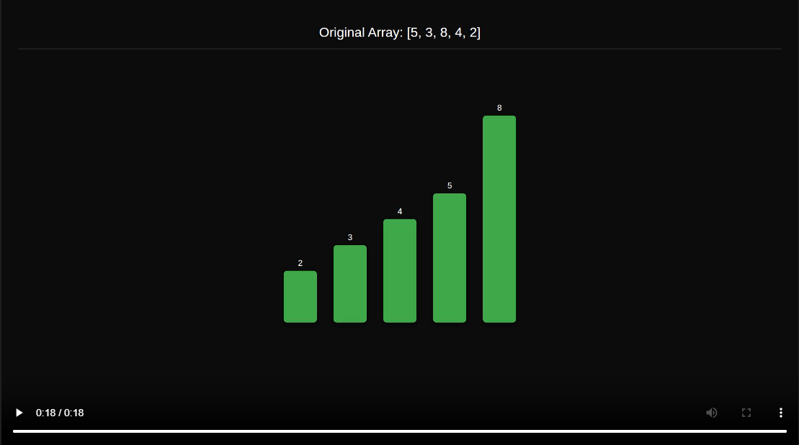

# Bubble Sort Animation



Este projeto utiliza o [Remotion](https://www.remotion.dev/) para criar uma animação visual do algoritmo de ordenação Bubble Sort.

> Projeto criado usando o prompt: [https://grok.com/share/bGVnYWN5_4a9ae7cb-e865-475f-9019-96b765ec1bbf](https://grok.com/share/bGVnYWN5_4a9ae7cb-e865-475f-9019-96b765ec1bbf)

## Instalação

1. Clone o repositório:
```bash
git clone https://github.com/seu-usuario/bubble-sort-animation.git
cd bubble-sort-animation
```

2. Instale as dependências:
```bash
npm install
```

## O Algoritmo

O Bubble Sort é implementado em `src/bubbleSort.ts`. O algoritmo funciona da seguinte forma:

1. Compara pares adjacentes de elementos
2. Se o elemento da esquerda for maior que o da direita, eles são trocados
3. Este processo se repete até que o array esteja ordenado

A implementação registra cada passo do algoritmo (comparações e trocas) para criar a animação. O código gera três tipos de passos:
- `compare`: quando dois elementos estão sendo comparados (amarelo)
- `swap`: quando dois elementos são trocados (vermelho)
- `done`: quando o array está ordenado (verde)

## Executando o Projeto

### Iniciar o Remotion Studio

Para visualizar e editar a animação em tempo real:

```bash
npm run dev
```

Isso abrirá o Remotion Studio no seu navegador (geralmente em http://localhost:3000).

### Gerando o Vídeo

Para renderizar o vídeo final:

```bash
npm run build
```

O vídeo será gerado na pasta `out/` com o nome `BubbleSort.mp4`.

## Estrutura do Projeto

- `src/bubbleSort.ts`: Implementação do algoritmo e geração dos passos
- `src/BubbleSortAnimation.tsx`: Componente React que renderiza a animação
- `src/Root.tsx`: Configuração da composição do vídeo (dimensões, duração, etc.)

## Personalização

A animação pode ser personalizada editando:

- Array inicial: modifique `INITIAL_ARRAY` em `src/bubbleSort.ts`
- Cores: ajuste o objeto `colors` em `src/BubbleSortAnimation.tsx`
- Dimensões: altere `barWidth`, `barSpacing` e `maxHeight` em `src/BubbleSortAnimation.tsx`
- Duração: cada passo leva 1 segundo, controlado pelo `fps` em `src/Root.tsx`

## Detalhes Técnicos

- Resolução: 1920x1080 pixels
- FPS: 30 quadros por segundo
- Duração: calculada automaticamente baseada no número de passos do algoritmo
- Formato de saída: MP4
